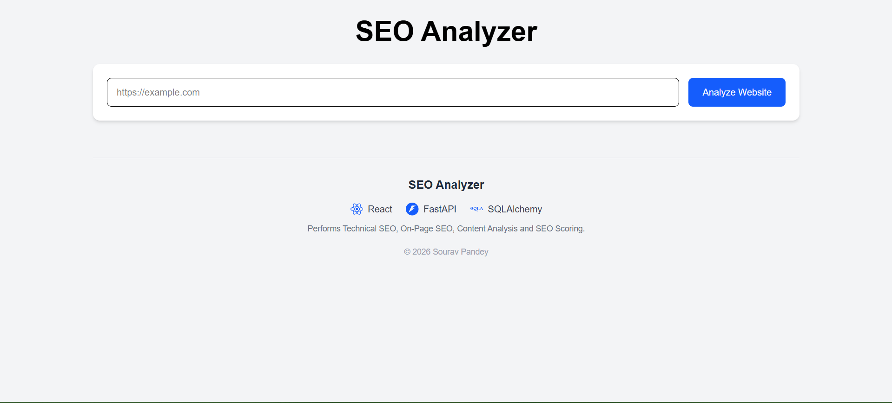
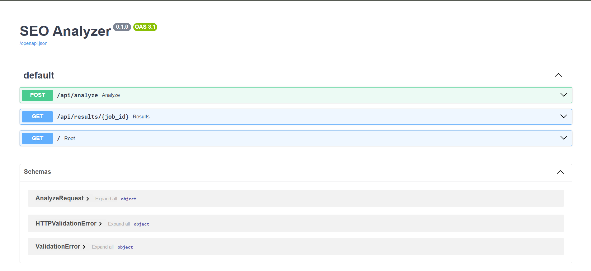
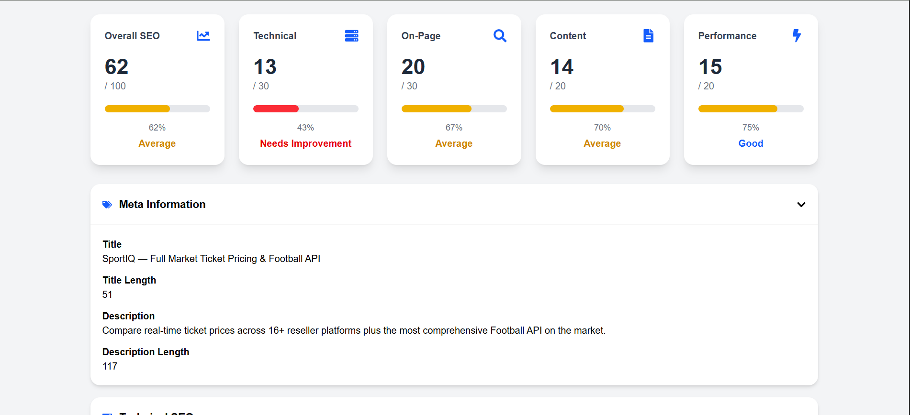
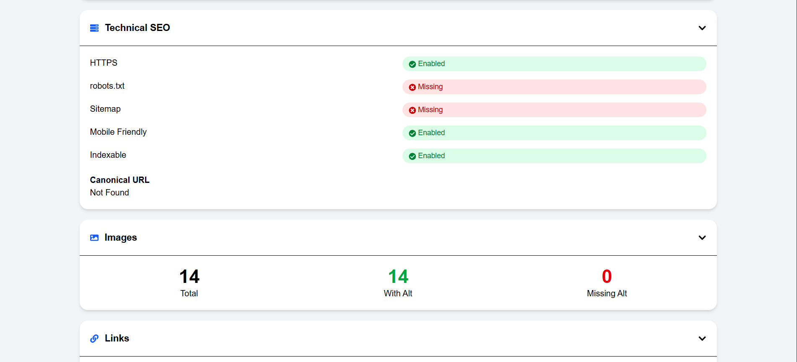
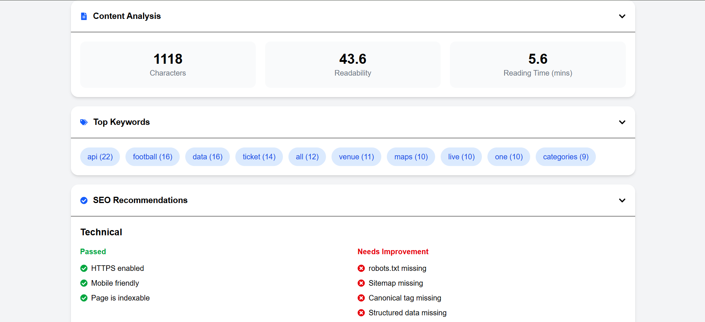
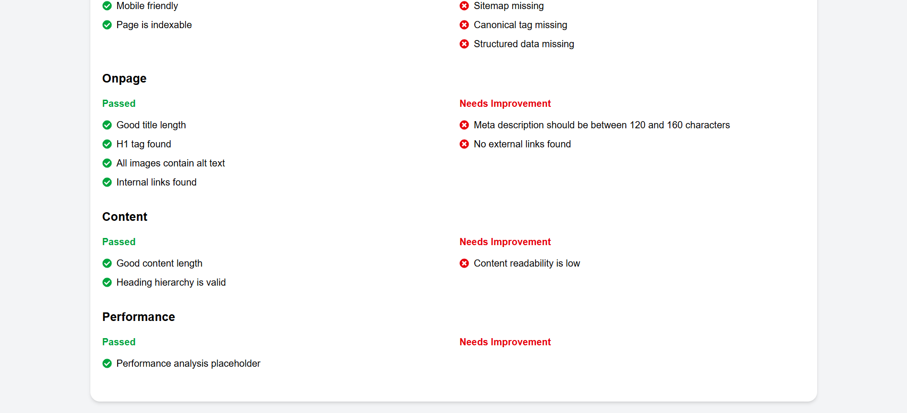

# SEO Analyzer

A **Woorank-inspired SEO Analyzer** built using **React**, **FastAPI**, and **SQLAlchemy**.

The application performs automated SEO audits for websites by analyzing on-page SEO, technical SEO, content quality, metadata, and overall SEO health. It uses a custom-built scoring system and asynchronous background processing without relying on Woorank APIs or paid third-party SEO services.

---

## 🌐 Live Demo

### Frontend

https://seo-analyzer-cyan.vercel.app/

### Backend

https://seo-analyzer-icm6.onrender.com

---

## 📂 GitHub Repository

https://github.com/unisourav-18/seo-analyzer

---

# ✨ Features

## Website Analysis

- Meta Title Analysis
- Meta Description Analysis
- Heading Analysis (H1–H6)
- Heading Hierarchy Validation
- Image Alt Tag Analysis
- Internal Link Analysis
- External Link Analysis
- URL Structure Analysis

---

## Technical SEO

- HTTPS Detection
- robots.txt Detection
- sitemap.xml Detection
- Canonical Tag Detection
- Redirect Detection
- Mobile Friendliness Detection
- Indexability Detection
- Structured Data Detection

---

## Content Analysis

- Content Length Analysis
- Readability Score
- Estimated Reading Time
- Keyword Extraction
- Heading Validation

---

## Social Metadata

- Open Graph Metadata
- Twitter Card Metadata

---

## SEO Scoring

The application generates:

- Technical SEO Score
- On-Page SEO Score
- Content Quality Score
- Performance Score
- Overall SEO Score (0–100)

---

## Backend Features

- FastAPI REST APIs
- Asynchronous Background Processing
- SQLAlchemy ORM
- SQLite (Development)
- PostgreSQL (Production)

---

## Frontend Features

- React + Vite
- Tailwind CSS
- Responsive Dashboard
- Modern Card-based UI
- Live SEO Report Visualization
- Loading Indicator
- Responsive Score Cards

---

# 🛠 Tech Stack

## Frontend

- React
- Vite
- Tailwind CSS
- Axios
- React Icons

## Backend

- FastAPI
- SQLAlchemy
- BeautifulSoup
- Requests
- Textstat

## Database

- SQLite (Development)
- PostgreSQL (Production)

## Deployment

- Vercel (Frontend)
- Render (Backend)

---

# 📁 Project Structure

```
seo-analyzer/
│
├── backend/
│   ├── app/
│   ├── requirements.txt
│   └── ...
│
├── frontend/
│   ├── src/
│   ├── package.json
│   └── ...
│
├── screenshots/
│   ├── home.png
│   ├── api_doc.png
│   ├── report1.png
│   ├── report2.png
│   ├── report3.png
│   └── report4.png
│
├── README.md
├── API_DOCUMENTATION.md
├── SEO_SCORING.md
└── BACKEND_ARCHITECTURE.md
```

---

# 🚀 Installation

## Clone Repository

```bash
git clone https://github.com/unisourav-18/seo-analyzer.git

cd seo-analyzer
```

---

## Backend

```bash
cd backend

pip install -r requirements.txt

uvicorn app.main:app --reload
```

Backend runs on

```
http://127.0.0.1:8000
```

---

## Frontend

```bash
cd frontend

npm install

npm run dev
```

Frontend runs on

```
http://localhost:5173
```

---

# 📡 API Endpoints

| Method | Endpoint | Description |
|---------|----------|-------------|
| POST | `/api/analyze` | Starts a new SEO analysis |
| GET | `/api/results/{job_id}` | Returns analysis status and report |

Detailed API documentation is available in:

```
API_DOCUMENTATION.md
```

---

# 📊 SEO Scoring

The custom scoring system evaluates websites using four categories:

| Category | Maximum Score |
|----------|--------------:|
| Technical SEO | 30 |
| On-Page SEO | 30 |
| Content Quality | 20 |
| Performance | 20 |
| **Overall** | **100** |

Detailed explanation:

```
SEO_SCORING.md
```

---

# 🏗 Backend Architecture

The backend follows a modular architecture with:

- FastAPI
- SQLAlchemy ORM
- Background Tasks
- Custom SEO Analyzer
- Scoring Engine
- Database-backed Job Tracking

Detailed explanation:

```
BACKEND_ARCHITECTURE.md
```

---

# 📸 Screenshots

## Home Page

```

```

## API Documentation

```

```

## SEO Report

```







```

---

# 🔮 Future Improvements

- Google Lighthouse Integration
- Core Web Vitals
- Multi-page Website Crawling
- Broken Link Detection
- PDF Report Export
- Historical Report Comparison
- User Authentication
- Dashboard Analytics
- Scheduled SEO Monitoring

---

# 👨‍💻 Author

**Sourav Pandey**

GitHub:

https://github.com/unisourav-18

---

# 📄 License

This project was developed as part of a technical assessment and is intended for educational and evaluation purposes.